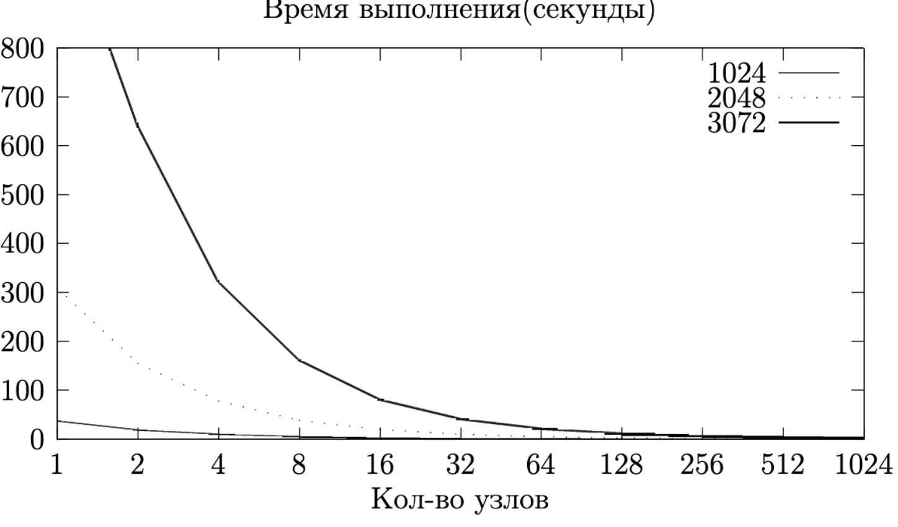
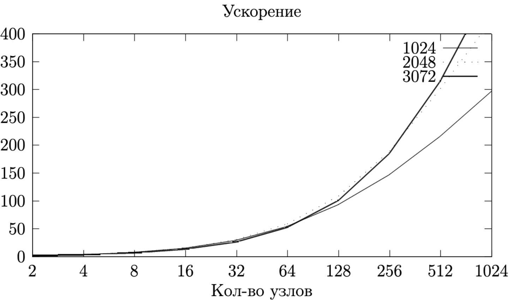
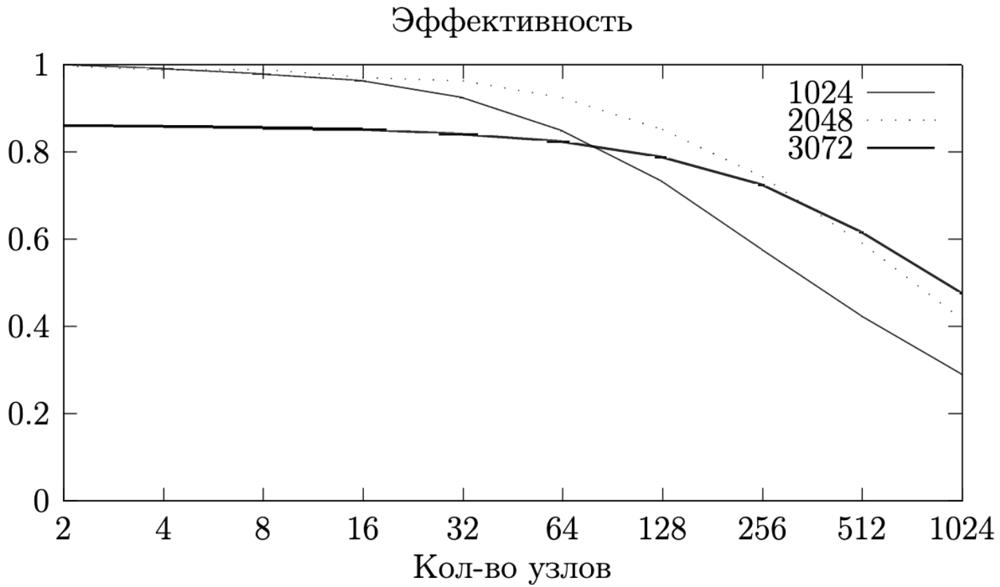

# Parallel MPI program for solving system of linear equations using Householder transformation

## Overview 
Solving system of linear equations by Householder method is divided into 3 parts.
1) Forward pass (tridiagonalization of the matrix, which is performed by Householder transformations)
2) Backward pass (solving linear system)

To make parallelization efficient matrix was stored distributed and in cyclic way.

## Build
```shell
make all
```

## Run
```shell
mpirun −np 4 ./res N input.txt
```
Or for random matrix
```shell
mpirun −np 4 ./res N
```

## Results on BlueGeneP (CMC MSU)
### Time (seconds) on different matrix size (1024, 2048, 3072)



### Speedup


### Efficiency
